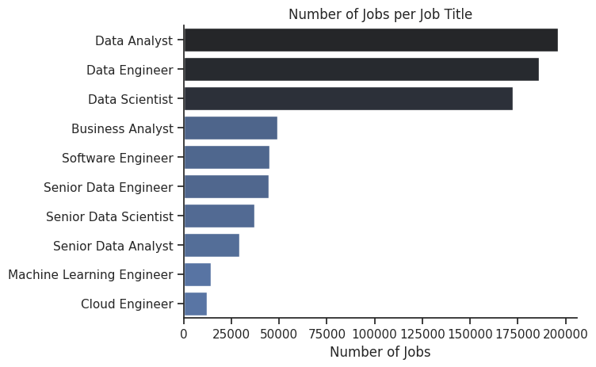
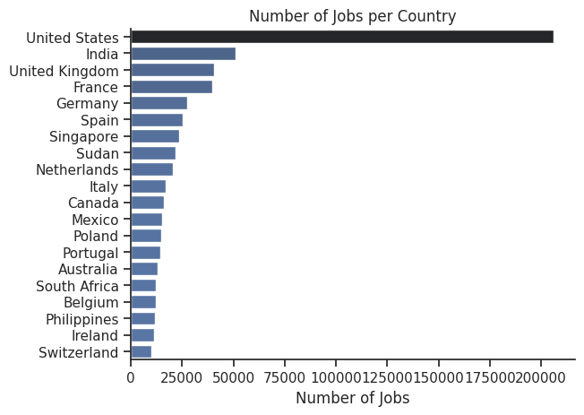
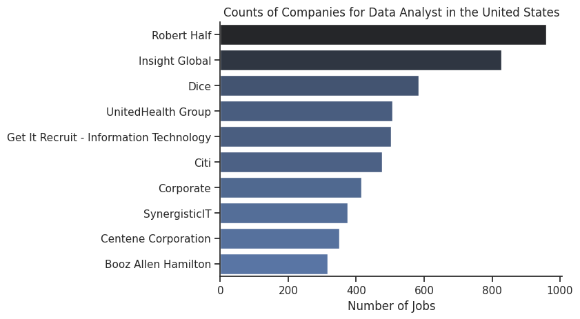
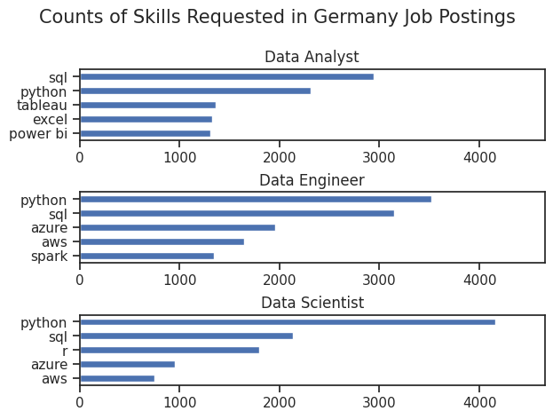
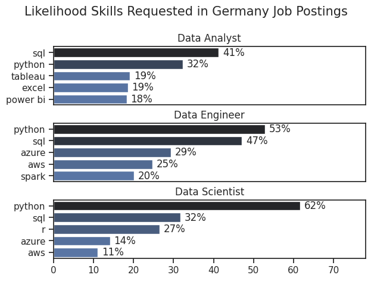
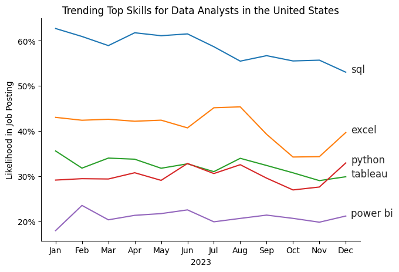
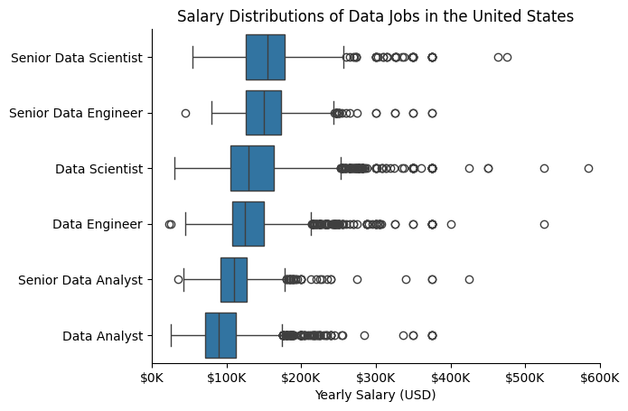
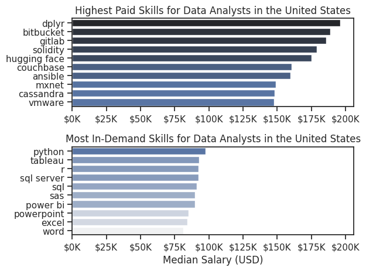
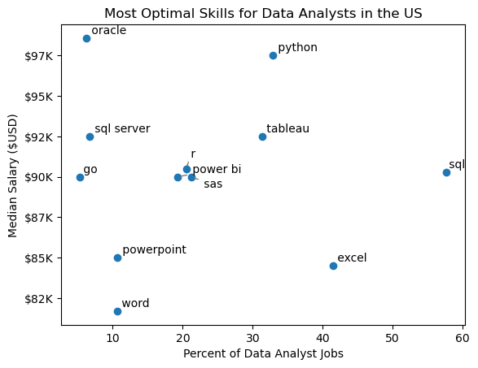
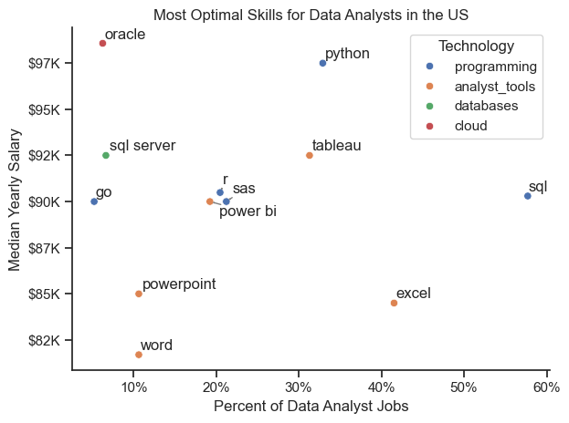

# Data Job Market Analysis

## Overview

This project explores the data job market through Python-based data analysis, focusing on Data Analyst roles. The goal was to understand which skills are most in demand, how that demand changes over time, how salaries vary across roles and skills, and which skills offer the best combination of demand and pay — essentially using data to answer the question "what should I learn next?"

The dataset contains real job postings with information on job titles, salaries, locations, companies, and required skills. Using pandas, matplotlib, and seaborn, I cleaned and explored the data, then built a series of analyses to answer specific questions about the job market.

Dataset source: [Luke Barousse's Python Course](https://lukebarousse.com/python)

**A key extension in this project:** instead of hardcoding the analysis to one country, every notebook accepts a `Country` variable. Changing this single value re-runs the entire analysis for any country in the dataset, making the project reusable for comparing job markets globally (e.g. India vs United States vs Germany).

## The Questions

1. What does the overall data job market look like — which roles, countries, and companies dominate?
2. What are the most in-demand skills for the top data roles?
3. How is skill demand for Data Analysts trending over time?
4. How well do data jobs and individual skills pay?
5. What are the most "optimal" skills to learn (high demand AND high pay)?

## Tools I Used

- **Python** — core language for the analysis
  - **Pandas** — data cleaning, filtering, grouping, and aggregation
  - **Matplotlib** — base visualizations
  - **Seaborn** — cleaner, more advanced statistical visualizations
- **Jupyter Notebooks** — to run code alongside notes and analysis
- **VS Code** — development environment
- **Git & GitHub** — version control and project sharing

## Data Preparation and Cleanup

Each notebook starts with the same setup: importing libraries, loading the dataset, and cleaning it.

```python
# Importing Libraries
import ast
import pandas as pd
import seaborn as sns
from datasets import load_dataset
import matplotlib.pyplot as plt  

# Loading Data
dataset = load_dataset('lukebarousse/data_jobs')
df = dataset['train'].to_pandas()

# Data Cleanup
df['job_posted_date'] = pd.to_datetime(df['job_posted_date'])
df['job_skills'] = df['job_skills'].apply(lambda x: ast.literal_eval(x) if pd.notna(x) else x)
```

The `job_posted_date` column is converted to a proper datetime so it can be used for time-based analysis. The `job_skills` column is stored as a string representation of a list (e.g. `"['python', 'sql', 'excel']"`), so `ast.literal_eval` converts it back into an actual Python list for each row.

## The Analysis

### 1. Exploratory Data Analysis (EDA)

Before diving into specific questions, I explored the dataset at a high level: which job titles, countries, and companies appear most often, and what kind of job opportunities are commonly offered (work from home, no degree required, health insurance).

I then built a country-flexible filter — by setting a single `Country` variable, the notebook re-filters the dataset for Data Analyst roles in that country and regenerates the location, company, and benefits charts.

View the notebook here: [1_EDA](1_EDA.ipynb)

#### Visualize Data

```python
df_plot = df['job_title_short'].value_counts().to_frame()

sns.set_theme(style='ticks')
sns.barplot(data=df_plot, x='count', y='job_title_short', hue='count', palette='dark:b_r', legend=False)
sns.despine()
plt.title('Number of Jobs per Job Title')
plt.xlabel('Number of Jobs')
plt.ylabel('')
plt.show()
```

#### Results

<!-- INSERT CHART: Bar chart - "Number of Jobs per Job Title" (overall dataset) -->


<!-- INSERT CHART: Bar chart - "Number of Jobs per Country" (top 20 countries) -->


<!-- INSERT CHART: Pie charts - Work From Home / Degree Requirement / Health Insurance (overall) -->


<!-- INSERT CHART: Bar chart - "Counts of Job Locations for Data Analyst" for chosen Country -->


#### Insights


- SQL is the most requested skill for Data Analysts and Data Scientists, with it in over half the job postings for both roles. For Data Engineers, Python is the most sought-after skill, appearing in 68% of job postings.
- Data Engineers require more specialized technical skills (AWS, Azure, Spark) compared to Data Analysts and Data Scientists who are expected to be proficient in more general data management and analysis tools (Excel, Tableau).
- Python is a versatile skill, highly demanded across all three roles, but most prominently for Data Scientists (72%) and Data Engineers (65%).


---

### 2. What are the most demanded skills for the top 3 most popular data roles?

To find the most in-demand skills, I exploded the `job_skills` column so each skill gets its own row, then counted how often each skill appears for each job title. I focused on the top 3 most popular job titles and looked at their top 5 skills, both as raw counts and as a percentage of job postings (so the results are comparable across roles with different total posting volumes).

This notebook is also country-flexible via the `Country` variable.

View the notebook here: [2_skill_demand](2_skill_demand.ipynb)

#### Visualize Data

```python
fig, ax = plt.subplots(len(job_titles), 1)

for i, job_title in enumerate(job_titles):
    df_plot = df_skill_perc[df_skill_perc['job_title_short'] == job_title].head(5)
    sns.barplot(data=df_plot, x='skill_percentage', y='job_skills', ax=ax[i], hue='skill_count', palette='dark:b_r')
    ax[i].set_title(job_title)
    ax[i].set_ylabel('')
    ax[i].set_xlabel('')
    ax[i].get_legend().remove()
    ax[i].set_xlim(0, 78)

    for n, v in enumerate(df_plot['skill_percentage']):
        ax[i].text(v + 1, n, f'{v:.0f}%', va='center')

fig.suptitle(f'Likelihood Skills Requested in {Country} Job Postings', fontsize=15)
fig.tight_layout(h_pad=0.5)
```

#### Results

<!-- INSERT CHART: Stacked horizontal bar charts - "Counts of Skills Requested in [Country] Job Postings" -->


<!-- INSERT CHART: Stacked horizontal bar charts - "Likelihood Skills Requested in [Country] Job Postings" (percentage version) -->


#### Insights


- SQL is the most requested skill for Data Analysts and Data Scientists, with it in over half the job postings for both roles. For Data Engineers, Python is the most sought-after skill, appearing in 68% of job postings.
- Data Engineers require more specialized technical skills (AWS, Azure, Spark) compared to Data Analysts and Data Scientists who are expected to be proficient in more general data management and analysis tools (Excel, Tableau).
- Python is a versatile skill, highly demanded across all three roles, but most prominently for Data Scientists (72%) and Data Engineers (65%).

---

### 3. How are in-demand skills trending for Data Analysts?

To see how skill demand changes over the year, I grouped Data Analyst job postings by the month they were posted, exploded the skills column, and pivoted the data so each skill becomes a column showing monthly counts. I then converted these counts into percentages of total monthly postings so the trend reflects relative demand rather than just total job volume (which fluctuates month to month).

View the notebook here: [3_skill_trend](3_skill_trend.ipynb)

#### Visualize Data

```python
df_plot = df_DA_percent.iloc[:, :5]

sns.lineplot(data=df_plot, dashes=False, palette='tab10')
sns.set_theme(style='ticks')
sns.despine()
plt.title(f'Trending Top Skills for Data Analysts in the {Country}')
plt.ylabel('Likelihood in Job Posting')
plt.xlabel('2023')

from matplotlib.ticker import PercentFormatter
ax = plt.gca()
ax.yaxis.set_major_formatter(PercentFormatter(decimals=0))
plt.legend().remove()

for i in range(5):
    plt.text(11.2, df_plot.iloc[-1, i], df_plot.columns[i])

plt.tight_layout()
```

#### Results

<!-- INSERT CHART: Line chart - "Trending Top Skills for Data Analysts in [Country]" -->


#### Insights


- SQL remains the most consistently demanded skill throughout the year, although it shows a gradual decrease in demand.
- Excel experienced a significant increase in demand starting around September, surpassing both Python and Tableau by the end of the year.
- Both Python and Tableau show relatively stable demand throughout the year with some fluctuations but remain essential skills for data analysts. Power BI, while less demanded compared to the others, shows a slight upward trend towards the year's end.

---

### 4. How well do jobs and skills pay for Data Analysts?

First, I looked at the overall salary distribution across the top 6 most common data job titles using a box plot, to understand how Data Analyst pay compares to roles like Data Scientist and Data Engineer. Then, focusing only on Data Analyst roles, I exploded the skills column and calculated the median salary associated with each skill — comparing the highest-paying skills against the most in-demand skills.

View the notebook here: [4_salary_analysis](4_salary_analysis.ipynb)

#### Visualize Data

```python
sns.boxplot(data=df_top6, x='salary_year_avg', y='job_title_short', order=job_order)
sns.set_theme(style='ticks')
sns.despine()

plt.title(f'Salary Distributions of Data Jobs in the {Country}')
plt.xlabel('Yearly Salary (USD)')
plt.ylabel('')
plt.xlim(0, 600000)
ticks_x = plt.FuncFormatter(lambda y, pos: f'${int(y/1000)}K')
plt.gca().xaxis.set_major_formatter(ticks_x)
plt.show()
```

```python
fig, ax = plt.subplots(2, 1)

# Top 10 Highest Paid Skills for Data Analysts
sns.barplot(data=df_DA_top_pay, x='median', y=df_DA_top_pay.index, hue='median', ax=ax[0], palette='dark:b_r')
ax[0].set_title(f'Highest Paid Skills for Data Analysts in the {Country}')

# Top 10 Most In-Demand Skills for Data Analysts
sns.barplot(data=df_DA_skills, x='median', y=df_DA_skills.index, hue='median', ax=ax[1], palette='light:b')
ax[1].set_title(f'Most In-Demand Skills for Data Analysts in the {Country}')

plt.tight_layout()
plt.show()
```

#### Results

<!-- INSERT CHART: Box plot - "Salary Distributions of Data Jobs in [Country]" (top 6 job titles) -->


<!-- INSERT CHART: Two bar charts - Highest Paid Skills vs Most In-Demand Skills for Data Analysts -->


#### Insights


- There's a significant variation in salary ranges across different job titles. Senior Data Scientist positions tend to have the highest salary potential, with up to $600K, indicating the high value placed on advanced data skills and experience in the industry.

- Senior Data Engineer and Senior Data Scientist roles show a considerable number of outliers on the higher end of the salary spectrum, suggesting that exceptional skills or circumstances can lead to high pay in these roles. In contrast, Data Analyst roles demonstrate more consistency in salary, with fewer outliers.

- The median salaries increase with the seniority and specialization of the roles. Senior roles (Senior Data Scientist, Senior Data Engineer) not only have higher median salaries but also larger differences in typical salaries, reflecting greater variance in compensation as responsibilities increase.

---

### 5. What are the most optimal skills to learn for Data Analysts?

To bring the analysis together, I calculated both the percentage of Data Analyst job postings that require each skill and the median salary associated with that skill. Plotting these two values against each other on a scatter plot highlights skills that are both **frequently requested** and **well paid** — the "sweet spot" for what to learn next. As a bonus, I categorized skills by technology type (e.g. programming, database, analyst tools) and color-coded the scatter plot accordingly.

View the notebook here: [5_Optimal_Skills](5_Optimal_Skills.ipynb)

#### Visualize Data

```python
plt.scatter(df_DA_skills_high_demand['skill_percent'], df_DA_skills_high_demand['median_salary'])
plt.xlabel('Percent of Data Analyst Jobs')
plt.ylabel('Median Salary ($USD)')
plt.title('Most Optimal Skills for Data Analysts')

ax = plt.gca()
ax.yaxis.set_major_formatter(plt.FuncFormatter(lambda y, pos: f'${int(y/1000)}K'))

plt.show()
```

```python
sns.scatterplot(
    data=df_DA_skills_tech_high_demand,
    x='skill_percent',
    y='median_salary',
    hue='technology'
)
plt.xlabel('Percent of Data Analyst Jobs')
plt.ylabel('Median Yearly Salary')
plt.title('Most Optimal Skills for Data Analysts (by Technology)')
plt.legend(title='Technology')
plt.show()
```

#### Results

<!-- INSERT CHART: Scatter plot - "Most Optimal Skills for Data Analysts" (skill demand % vs median salary) -->


<!-- INSERT CHART: Scatter plot - same as above, color-coded by technology category -->


#### Insights

- The scatter plot shows that most of the `programming` skills (colored blue) tend to cluster at higher salary levels compared to other categories, indicating that programming expertise might offer greater salary benefits within the data analytics field.

- The database skills (colored orange), such as Oracle and SQL Server, are associated with some of the highest salaries among data analyst tools. This indicates a significant demand and valuation for data management and manipulation expertise in the industry.

- Analyst tools (colored green), including Tableau and Power BI, are prevalent in job postings and offer competitive salaries, showing that visualization and data analysis software are crucial for current data roles. This category not only has good salaries but is also versatile across different types of data tasks.

---

## What I Learned

- **Pandas for real analysis** — going beyond basic filtering into `explode()`, `groupby()`, `pivot_table()`, and merging multiple DataFrames to reshape data for specific questions.
- **Visualization with purpose** — using matplotlib and seaborn not just to "make a chart" but to choose the right chart type (bar, box, line, scatter) for the question being asked, and formatting axes (percentages, currency) so charts are easy to read.
- **Reusable analysis design** — by parameterizing the country across all notebooks, the same analysis pipeline can answer the same questions for any market, not just one.
- **Counts vs. percentages** — raw counts can be misleading when comparing groups of different sizes; converting to percentages gives a fairer comparison.

## Challenges I Faced

- **Working with nested/list data** — the `job_skills` column required converting strings to lists and exploding rows, which took some trial and error to get right.
- **Aligning chart scales** — when comparing multiple subplots (e.g. top skills per job title), making sure all charts share the same x-axis scale so they're visually comparable.
- **Generalizing the code** — adapting hardcoded, single-country logic into a flexible structure that works for any `Country` value without breaking.

## Conclusion

This project gave me hands-on experience turning a raw dataset into actionable insights about the data job market — what's in demand, what pays well, and how that changes over time and across countries. The country-flexible design also means this isn't a one-time analysis; it's a reusable tool I can point at any market to get a quick read on the skills landscape for data roles.
